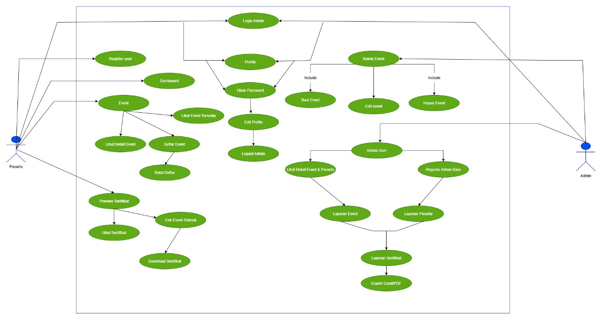
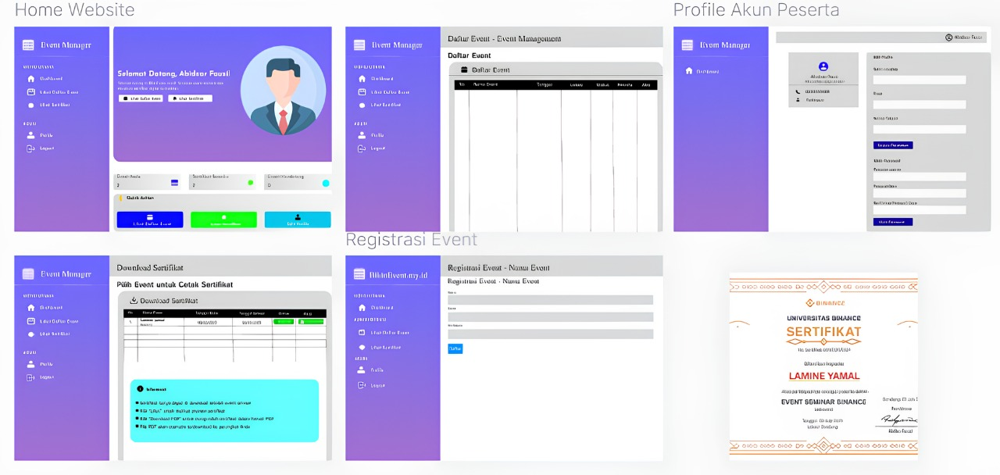
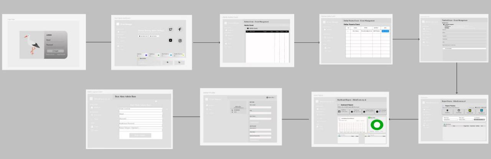
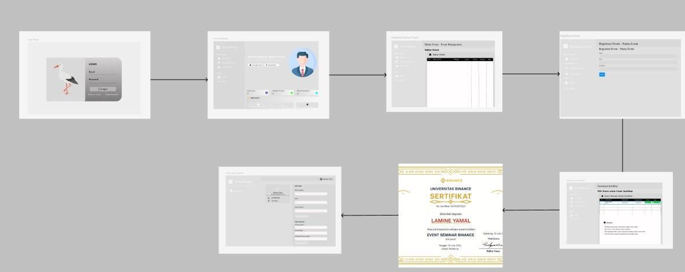

# 🎯 Event Manager - Sistem Manajemen Event & Sertifikat

<div align="center">
  
  
  
  
</div>

---

## 🚀 Quick Start - Instalasi Lokal

### Untuk Pengguna Windows:

1. **Setup Awal** (hanya sekali)
   ```
   Double-click: setup_awal.bat
   ```

2. **Import Database**
   - Buka phpMyAdmin: `http://localhost/phpmyadmin`
   - Klik tab "SQL"
   - Copy paste isi file `database_setup.sql`
   - Klik "Go"

3. **Jalankan Aplikasi**
   ```
   Double-click: jalankan_aplikasi.bat
   ```

4. **Buka Browser**
   ```
   http://localhost:8080
   ```

### 👤 Login Default:
- **Admin:** admin@bikinevent.my.id / admin123
- **Peserta:** peserta@bikinevent.my.id / peserta123

📖 **Panduan Lengkap:** Lihat file **[INSTALASI_LOKAL.md](INSTALASI_LOKAL.md)** untuk troubleshooting dan instalasi manual.

---

## 👥 Tim Pengembang

<table align="center"> <tr> <th>Nama</th> <th>NIM</th> <th>Role</th> </tr> <tr> <td><strong>Andika Setiawan</strong></td> <td>312310470</td> <td>Project Manager & Frontend Developer</td> </tr> <tr> <td><strong>Daffa Sadewa Putra</strong></td> <td>312310463</td> <td>Database Administrator & Mockup Designer</td> </tr> <tr> <td><strong>Luthfi Fauzan</strong></td> <td>312310497</td> <td>Backend Developer</td> </tr> </table>
---

## 📋 Deskripsi Proyek

**Event Manager** adalah sistem manajemen event dan sertifikat berbasis web yang komprehensif, dirancang untuk memudahkan pengelolaan acara dari tahap perencanaan hingga distribusi sertifikat. Platform ini memungkinkan administrator untuk mengelola event secara efisien dengan fitur-fitur canggih seperti analytics real-time, export data, dan generator sertifikat otomatis. Sementara itu, peserta dapat dengan mudah mendaftar ke berbagai event dan mengunduh sertifikat digital mereka setelah event selesai.

Sistem ini dibangun menggunakan **CodeIgniter 4** sebagai framework backend yang powerful, dengan antarmuka yang modern dan responsif menggunakan **Bootstrap 5**. Database **MySQL** digunakan untuk menyimpan data dengan struktur yang teroptimasi, sementara berbagai library seperti **TCPDF** untuk generate PDF dan **Chart.js** untuk visualisasi data memberikan fungsionalitas yang lengkap.

🌐 **Website Demo:** [https://bikinevent.my.id/](https://bikinevent.my.id/)

### 🎯 **Tujuan Proyek**

1. **Digitalisasi Manajemen Event** - Mengubah proses manual menjadi sistem digital yang efisien
2. **Otomatisasi Sertifikat** - Menghilangkan proses manual pembuatan dan distribusi sertifikat
3. **Centralized Data Management** - Menyediakan satu platform untuk semua kebutuhan event management
4. **User Experience yang Optimal** - Interface yang intuitif untuk admin dan peserta
5. **Scalability & Performance** - Sistem yang dapat menangani event dengan jumlah peserta besar

### ✨ Fitur Utama

#### 🔐 **Akun Administrator**

- **Dashboard Admin** - Ringkasan statistik real-time dengan visualisasi data yang menarik, quick actions untuk akses cepat ke fitur utama, dan monitoring aktivitas sistem secara keseluruhan
- **Kelola Event** - CRUD (Create, Read, Update, Delete) event dengan form yang komprehensif, upload gambar event, pengaturan batas peserta, dan manajemen status event
- **Kelola Peserta** - Manajemen data peserta dengan fitur pencarian dan filter canggih, tracking status pendaftaran, dan kemampuan untuk mengelola peserta secara individual atau batch
- **Laporan & Analytics** - Dashboard analytics dengan grafik trend bulanan, statistik event dan peserta, diagram pie untuk status event, dan insights mendalam tentang performa platform
- **Manajemen Sertifikat** - Generator sertifikat otomatis dengan template yang dapat dikustomisasi, preview sebelum generate, dan sistem distribusi yang efisien
- **Export Data** - Kemampuan export data ke format Excel dan PDF dengan filter yang fleksibel untuk keperluan laporan dan dokumentasi

#### 👤 **Akun Peserta**

- **Dashboard Peserta** - Overview personal dengan ringkasan event yang diikuti, sertifikat yang tersedia, dan quick access ke fitur-fitur utama dengan interface yang user-friendly
- **Daftar Event** - Browse semua event yang tersedia dengan sistem pencarian dan filter, tampilan detail event yang informatif, dan status ketersediaan slot peserta
- **Registrasi Event** - Form pendaftaran yang mudah dan intuitif dengan validasi real-time, konfirmasi pendaftaran otomatis, dan notifikasi status
- **Download Sertifikat** - Akses dan unduh sertifikat digital dalam format PDF berkualitas tinggi, dengan preview sebelum download dan sistem verifikasi sertifikat
- **Profile Management** - Edit profil lengkap dengan foto, ubah password dengan sistem keamanan yang kuat, dan riwayat aktivitas peserta

---

## � Analisis Sistem & Use Case

### � Diagram Use Case

<div align="center">
  
  <br><strong>Use Case Diagram - Event Manager System</strong>
</div>

#### 🎭 **Aktor dan Fungsi Sistem**

### 👤 **Aktor: Peserta**

Peserta adalah pengguna utama sistem yang berinteraksi dengan platform untuk mengikuti berbagai event dan memperoleh sertifikat. Mereka memiliki akses terbatas namun lengkap untuk kebutuhan partisipasi event, mulai dari registrasi hingga mendapatkan sertifikat digital.

**Fungsi Utama yang Dapat Dilakukan Peserta:**

1. **Register User** - Mendaftar akun sebagai peserta baru di sistem dengan validasi email dan data pribadi yang lengkap, termasuk verifikasi akun untuk keamanan
2. **Login & Akses Dashboard** - Mengakses sistem menggunakan kredensial yang aman untuk melihat event, aktivitas pribadi, dan statistik partisipasi dengan interface yang responsif
3. **Event Management:**
   - **Lihat Event Tersedia** - Menampilkan daftar semua event yang tersedia dengan filter berdasarkan kategori, tanggal, dan lokasi, serta informasi ketersediaan slot
   - **Lihat Detail Event** - Menampilkan informasi lengkap tentang event termasuk deskripsi, jadwal, lokasi, persyaratan, dan benefit yang akan diperoleh
   - **Daftar Event** - Mengisi form pendaftaran yang komprehensif dengan validasi data real-time dan konfirmasi otomatis via email
   - **Batal Daftar** - Membatalkan keikutsertaan pada event sebelum batas waktu yang ditentukan dengan sistem notifikasi otomatis
4. **Preview Sertifikat** - Melihat tampilan awal sertifikat dengan design yang akan diterima, termasuk informasi yang akan tertera di sertifikat
5. **Cek Event Selesai** - Mengecek status event yang diikuti apakah sudah selesai dan sertifikat sudah tersedia untuk diunduh
6. **Lihat & Download Sertifikat** - Mengakses dan mengunduh sertifikat dalam format PDF berkualitas tinggi dengan sistem verifikasi dan watermark
7. **Edit Profile & Ubah Password** - Mengubah data pribadi, foto profil, dan kata sandi dengan sistem keamanan berlapis dan verifikasi email
8. **Logout** - Keluar dari sistem dengan pembersihan session yang aman dan log aktivitas

### 🔧 **Aktor: Admin**

Admin adalah pengguna dengan hak akses penuh yang bertanggung jawab mengelola seluruh aspek sistem, mulai dari manajemen event, pengelolaan peserta, hingga monitoring dan pelaporan. Admin memiliki dashboard khusus dengan fitur analytics dan kontrol penuh atas platform.

**Fungsi Utama yang Dapat Dilakukan Admin:**

1. **Login Admin** - Masuk ke sistem sebagai administrator dengan autentikasi berlapis dan sistem keamanan tinggi, termasuk log aktivitas admin
2. **Kelola Event:**
   - **Buat Event** - Menambahkan event baru dengan form lengkap termasuk upload gambar, pengaturan kapasitas, jadwal, lokasi, dan konfigurasi sertifikat
   - **Edit Event** - Mengubah data event yang sudah ada dengan tracking perubahan dan notifikasi otomatis ke peserta yang terdaftar
   - **Hapus Event** - Menghapus event yang tidak relevan dengan sistem konfirmasi dan backup data untuk recovery
3. **Kelola User:**
   - **Register Admin Baru** - Menambahkan akun admin baru dengan pengaturan role dan permission yang spesifik
   - **Lihat Detail Event & Peserta** - Monitoring detail peserta per event dengan informasi lengkap, status pendaftaran, dan riwayat aktivitas
   - **Manajemen User** - Kelola akun peserta, suspend/activate user, dan reset password dengan sistem notifikasi
4. **Laporan Sistem:**
   - **Laporan Event** - Dashboard analytics dengan grafik trend, statistik event aktif/selesai, dan performa event berdasarkan berbagai metrik
   - **Laporan Peserta** - Analisis data peserta dengan segmentasi, tracking engagement, dan insights partisipasi
   - **Laporan Sertifikat** - Monitoring distribusi sertifikat, status download, dan validasi sertifikat yang telah diterbitkan
   - **Export Excel/PDF** - Sistem export yang fleksibel dengan filter custom, template yang dapat disesuaikan, dan scheduling otomatis
5. **Dashboard Analytics** - Real-time monitoring dengan KPI dashboard, alert system, dan predictive analytics untuk planning event
6. **Edit Profile & Ubah Password** - Mengelola data pribadi admin dengan sistem keamanan berlapis dan audit trail
7. **Logout Admin** - Keluar dari sistem dengan pembersihan session yang aman dan log aktivitas admin

---

## 🎨 Design & Mockup

### 📱 Mockup Aplikasi

<div align="center">
  <table>
    <tr>
      <td align="center">
        
        <br><strong>Mockup Akun Admin</strong>
      </td>
      <td align="center">
        
        <br><strong>Mockup Akun Peserta</strong>
      </td>
    </tr>
  </table>
</div>

---

## 📖 Storyboard Aplikasi

### 🔧 **Akun Administrator**

<div align="center">
  
</div>

#### **Alur Kerja Admin:**

1. **🔐 Halaman Login**

   - Desain modern dengan ilustrasi bangau sebagai branding
   - Form login dengan email dan password
   - Gradien ungu yang menenangkan sebagai background

2. **📊 Dashboard Admin**

   - Panel selamat datang dengan gradien ungu
   - Statistik cepat: Total Event, Total Peserta, Event Mendatang
   - Quick Actions: Tambah Event, Kelola Peserta, Buat Admin

3. **📅 Kelola Event**

   - Tabel daftar event dengan kolom lengkap
   - Aksi: Edit, Hapus, Detail, Lihat Peserta
   - Tombol tambah event baru

4. **👥 Daftar Peserta Event**

   - Tabel peserta dengan informasi kontak
   - Fitur cetak sertifikat per peserta

5. **➕ Tambah Event**

   - Form lengkap dengan petunjuk pengisian
   - Input: Nama, Deskripsi, Tanggal, Lokasi, Batas Peserta
   - Informasi sertifikat dan logo institusi

6. **📈 Kelola Peserta & Reports**
   - Statistik peserta dan filter pencarian
   - Export data ke Excel dan PDF
   - Grafik trend bulanan dan status event

### 👤 **Akun Peserta**

<div align="center">
  
</div>

#### **Alur Kerja Peserta:**

1. **🔐 Halaman Login**

   - Interface yang sama dengan admin
   - Akses khusus untuk peserta

2. **🏠 Home Dashboard**

   - Sambutan personal dengan nama peserta
   - Ringkasan: Event Anda, Sertifikat Tersedia, Event Mendatang
   - Quick Actions: Lihat Event, Lihat Sertifikat, Edit Profile

3. **📋 Daftar Event**

   - Tabel event tersedia dengan status dan detail
   - Aksi: Detail, Daftar Event

4. **📝 Registrasi Event**

   - Form pendaftaran sederhana
   - Input: Nama, Email, No. Telepon

5. **🏆 Lihat Sertifikat**

   - Daftar event yang sudah selesai
   - Download sertifikat dalam format PDF
   - Preview sebelum download

6. **👤 Profile Peserta**
   - Edit informasi personal
   - Ubah password untuk keamanan
   - Kartu informasi profil

---

## 🚀 Teknologi yang Digunakan

### 🔧 **Backend Technologies**

- **PHP 8.1+** - Bahasa pemrograman server-side modern dengan fitur-fitur terbaru seperti named arguments, match expressions, dan improved performance
- **CodeIgniter 4** - Framework PHP yang powerful, ringan, dan mudah dipelajari dengan arsitektur MVC yang clean dan dokumentasi yang lengkap
- **MySQL 8.0** - Database management system yang robust dengan fitur JSON support, window functions, dan performance optimization

### 🎨 **Frontend Technologies**

- **HTML5** - Markup language terbaru dengan semantic elements dan API modern untuk struktur halaman web yang optimal
- **CSS3** - Styling language dengan fitur advanced seperti flexbox, grid, animations, dan responsive design capabilities
- **JavaScript ES6+** - Bahasa pemrograman client-side dengan fitur modern seperti arrow functions, async/await, dan modules
- **Bootstrap 5** - Framework CSS terpopuler untuk responsive design dengan utility classes dan component library yang lengkap

### 📚 **Libraries & Tools**

- **TCPDF 6.10+** - Library PHP untuk generate PDF berkualitas tinggi dengan support untuk custom fonts, images, dan complex layouts
- **Font Awesome 6** - Icon library terlengkap dengan ribuan icon vector yang scalable dan customizable
- **Chart.js 4** - Library JavaScript untuk visualisasi data dengan berbagai jenis chart yang interaktif dan responsive
- **DataTables** - jQuery plugin untuk enhanced table functionality dengan sorting, searching, pagination, dan export features
- **jQuery 3.6+** - JavaScript library untuk DOM manipulation dan AJAX requests yang simplified
- **SweetAlert2** - Library untuk beautiful alert dialogs dan notifications yang user-friendly

### 🔒 **Security & Performance**

- **Password Hashing** - Menggunakan PHP password_hash() dengan algoritma bcrypt untuk keamanan password
- **CSRF Protection** - Built-in CSRF protection dari CodeIgniter 4 untuk mencegah cross-site request forgery
- **Input Validation** - Comprehensive input validation dan sanitization untuk mencegah SQL injection dan XSS attacks
- **Session Management** - Secure session handling dengan encryption dan proper session timeout

---

## 🎯 Fitur Unggulan

### 🔥 **Highlights**

- **Responsive Design** - Tampilan optimal di semua device
- **Real-time Analytics** - Dashboard dengan statistik live
- **PDF Certificate Generator** - Sertifikat otomatis dengan template custom
- **Advanced Filtering** - Pencarian dan filter data yang powerful
- **Export Functionality** - Export data ke Excel dan PDF
- **Secure Authentication** - Sistem login yang aman dengan role-based access

### 🎨 **UI/UX Features**

- **Modern Gradient Design** - Tema ungu yang elegan dan profesional
- **Intuitive Navigation** - Sidebar navigation yang user-friendly
- **Interactive Tables** - DataTables dengan sorting dan pagination
- **Quick Actions** - Tombol akses cepat untuk fungsi utama
- **Visual Feedback** - Loading states dan success/error messages

---

## 🌐 Demo & Deployment

> **Note:** Aplikasi ini siap untuk hosting dengan konfigurasi yang sudah dioptimalkan.

### 📋 **Persyaratan Sistem**

- PHP 8.0 atau lebih tinggi
- MySQL 8.0 atau MariaDB 10.4+
- Composer (untuk dependency management)


<div align="center">
  <strong>🎉 Terima kasih telah menggunakan Event Manager! 🎉</strong>
  <br><br>
  <em>Dibuat dengan ❤️ oleh Tim Pengembang</em>
</div>
